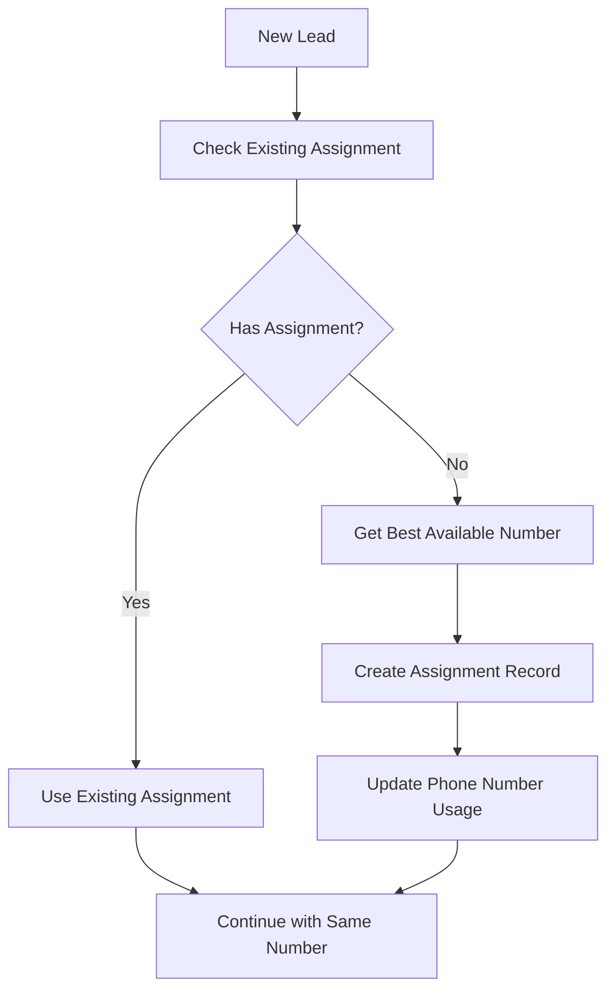
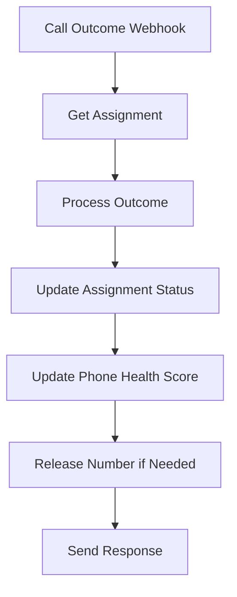

# n8n Tables Setup Guide

## 🎯 Overview
This guide explains how to set up n8n's native table management for the phone number pool system, replacing external database dependencies with built-in table functionality.

---

## 📊 Table Schemas

### **1. Phone Numbers Table**

Create a table named `phone_numbers` with the following columns:

| Column Name | Type | Description | Required |
|-------------|------|-------------|----------|
| `id` | Text | Unique identifier | Yes |
| `number` | Text | Phone number (E.164 format) | Yes |
| `signalwire_id` | Text | SignalWire phone number ID | Yes |
| `broker_id` | Text | Broker this number belongs to | Yes |
| `is_active` | Boolean | Whether number is active in pool | Yes |
| `last_used_at` | DateTime | Last time this number was used | No |
| `health_score` | Number | Health score (0-100) | Yes |
| `call_count` | Number | Total calls made from this number | Yes |
| `answer_rate` | Number | Answer rate percentage | Yes |
| `area_code` | Text | Area code for local presence | No |
| `state` | Text | State this number is from | No |
| `created_at` | DateTime | When number was added to pool | Yes |

### **2. Lead Number Assignments Table**

Create a table named `lead_number_assignments` with the following columns:

| Column Name | Type | Description | Required |
|-------------|------|-------------|----------|
| `id` | Text | Unique identifier | Yes |
| `lead_id` | Text | Assigned lead | Yes |
| `number_id` | Text | Assigned phone number | Yes |
| `broker_id` | Text | Broker handling this lead | Yes |
| `status` | Text | Assignment status | Yes |
| `assigned_at` | DateTime | When number was assigned | Yes |
| `released_at` | DateTime | When number was released | No |
| `call_attempts` | Number | Number of call attempts made | Yes |
| `last_call_at` | DateTime | Last call attempt timestamp | No |
| `first_answered_at` | DateTime | When lead first answered | No |
| `booked_at` | DateTime | When appointment was booked | No |
| `max_attempts` | Number | Maximum call attempts | Yes |
| `notes` | Text | Assignment notes and context | No |

---

## 🚀 Setup Instructions

### **Step 1: Create Tables in n8n**

1. **Open n8n** and go to **Tables** section
2. **Click "Create Table"**
3. **Name**: `phone_numbers`
4. **Add columns** as specified above
5. **Repeat** for `lead_number_assignments` table

### **Step 2: Initialize Phone Numbers**

Add your SignalWire phone numbers to the `phone_numbers` table:

```json
{
  "id": "phone_001",
  "number": "+15551234567",
  "signalwire_id": "sw_123456",
  "broker_id": "broker_smith",
  "is_active": true,
  "health_score": 100,
  "call_count": 0,
  "answer_rate": 0,
  "area_code": "555",
  "state": "CA",
  "created_at": "2024-01-01T00:00:00Z"
}
```

### **Step 3: Configure Table Permissions**

1. **Go to Table Settings**
2. **Set Access Control**:
   - **Read**: All authenticated users
   - **Write**: Workflow execution only
   - **Delete**: Admin only

---

## 🔧 n8n Table Operations

### **1. Get Rows (with filtering)**

```json
{
  "operation": "getRows",
  "tableName": "phone_numbers",
  "options": {
    "filter": {
      "conditions": [
        {
          "column": "broker_id",
          "operator": "equals",
          "value": "broker_smith"
        },
        {
          "column": "is_active",
          "operator": "equals",
          "value": true
        }
      ]
    },
    "sort": [
      {
        "column": "health_score",
        "direction": "desc"
      }
    ],
    "limit": 10
  }
}
```

### **2. Insert Row**

```json
{
  "operation": "insertRow",
  "tableName": "lead_number_assignments",
  "columns": {
    "lead_id": "lead_123",
    "number_id": "phone_001",
    "broker_id": "broker_smith",
    "status": "active",
    "max_attempts": 5,
    "assigned_at": "2024-01-01T00:00:00Z",
    "call_attempts": 0
  }
}
```

### **3. Update Row**

```json
{
  "operation": "updateRow",
  "tableName": "lead_number_assignments",
  "id": "assignment_123",
  "columns": {
    "status": "booked_locked",
    "booked_at": "2024-01-01T12:00:00Z",
    "call_attempts": 3
  }
}
```

### **4. Get Single Row**

```json
{
  "operation": "getRow",
  "tableName": "phone_numbers",
  "id": "phone_001"
}
```

---

## 📈 Advanced Queries

### **1. Find Available Numbers for Broker**

```json
{
  "operation": "getRows",
  "tableName": "phone_numbers",
  "options": {
    "filter": {
      "conditions": [
        {
          "column": "broker_id",
          "operator": "equals",
          "value": "={{$json.broker_id}}"
        },
        {
          "column": "is_active",
          "operator": "equals",
          "value": true
        },
        {
          "column": "state",
          "operator": "equals",
          "value": "={{$json.lead_state}}"
        }
      ]
    },
    "sort": [
      {
        "column": "health_score",
        "direction": "desc"
      }
    ],
    "limit": 1
  }
}
```

### **2. Get Active Assignments for Lead**

```json
{
  "operation": "getRows",
  "tableName": "lead_number_assignments",
  "options": {
    "filter": {
      "conditions": [
        {
          "column": "lead_id",
          "operator": "equals",
          "value": "={{$json.lead_id}}"
        },
        {
          "column": "status",
          "operator": "in",
          "value": "active,booked_locked"
        }
      ]
    }
  }
}
```

### **3. Find Numbers to Release**

```json
{
  "operation": "getRows",
  "tableName": "lead_number_assignments",
  "options": {
    "filter": {
      "conditions": [
        {
          "column": "status",
          "operator": "equals",
          "value": "unreachable"
        },
        {
          "column": "released_at",
          "operator": "is_null",
          "value": true
        }
      ]
    }
  }
}
```

---

## 🔄 Workflow Integration

### **1. Phone Number Assignment Flow**



### **2. Call Outcome Processing Flow**



---

## 📊 Monitoring & Analytics

### **1. Pool Utilization Query**

```json
{
  "operation": "getRows",
  "tableName": "phone_numbers",
  "options": {
    "filter": {
      "conditions": [
        {
          "column": "broker_id",
          "operator": "equals",
          "value": "broker_smith"
        }
      ]
    }
  }
}
```

**Calculate in Function Node:**
```javascript
const numbers = $input.all();
const total = numbers.length;
const active = numbers.filter(n => n.json.is_active).length;
const inUse = numbers.filter(n => n.json.last_used_at && 
  new Date(n.json.last_used_at) > new Date(Date.now() - 24*60*60*1000)).length;

return [{
  json: {
    total_numbers: total,
    active_numbers: active,
    numbers_in_use: inUse,
    utilization_rate: (inUse / active * 100).toFixed(2) + '%'
  }
}];
```

### **2. Health Score Distribution**

```json
{
  "operation": "getRows",
  "tableName": "phone_numbers",
  "options": {
    "filter": {
      "conditions": [
        {
          "column": "is_active",
          "operator": "equals",
          "value": true
        }
      ]
    },
    "sort": [
      {
        "column": "health_score",
        "direction": "desc"
      }
    ]
  }
}
```

---

## 🚨 Troubleshooting

### **Common Issues**

#### **1. Table Not Found**
- **Cause**: Table doesn't exist or wrong name
- **Solution**: Verify table name matches exactly
- **Prevention**: Use consistent naming convention

#### **2. Column Not Found**
- **Cause**: Column name mismatch or doesn't exist
- **Solution**: Check column names in table schema
- **Prevention**: Use exact column names from schema

#### **3. Filter Not Working**
- **Cause**: Incorrect filter syntax or data types
- **Solution**: Verify filter conditions and data types
- **Prevention**: Test filters with simple queries first

#### **4. Permission Denied**
- **Cause**: Insufficient table permissions
- **Solution**: Check table access settings
- **Prevention**: Set appropriate permissions during setup

### **Debug Queries**

```json
// Test basic table access
{
  "operation": "getRows",
  "tableName": "phone_numbers",
  "options": {
    "limit": 1
  }
}

// Test specific filter
{
  "operation": "getRows",
  "tableName": "phone_numbers",
  "options": {
    "filter": {
      "conditions": [
        {
          "column": "is_active",
          "operator": "equals",
          "value": true
        }
      ]
    }
  }
}
```

---

## 🎯 Best Practices

### **1. Table Design**
- **Use consistent naming**: snake_case for columns
- **Set appropriate data types**: Match your data exactly
- **Add indexes**: For frequently queried columns
- **Document columns**: Clear descriptions for each field

### **2. Query Optimization**
- **Use filters**: Reduce data transfer
- **Limit results**: Don't fetch unnecessary data
- **Sort efficiently**: Use indexed columns when possible
- **Batch operations**: Group related updates

### **3. Error Handling**
- **Check table existence**: Before operations
- **Validate data types**: Before inserting/updating
- **Handle empty results**: Gracefully
- **Log errors**: For debugging

### **4. Performance**
- **Monitor query performance**: Check execution times
- **Optimize filters**: Use most selective conditions first
- **Cache frequently used data**: When appropriate
- **Clean up old data**: Regular maintenance

---

## 🚀 Migration from External Database

### **1. Export Data**
```sql
-- Export from your current database
SELECT * FROM phone_numbers;
SELECT * FROM lead_number_assignments;
```

### **2. Transform Data**
```javascript
// Transform to n8n table format
const transformedData = originalData.map(row => ({
  id: row.id,
  number: row.phone_number,
  signalwire_id: row.signalwire_id,
  broker_id: row.broker_id,
  is_active: row.is_active,
  health_score: row.health_score || 100,
  call_count: row.call_count || 0,
  answer_rate: row.answer_rate || 0,
  area_code: row.area_code,
  state: row.state,
  created_at: row.created_at
}));
```

### **3. Import to n8n Tables**
```json
{
  "operation": "insertRow",
  "tableName": "phone_numbers",
  "columns": "={{$json}}"
}
```

---

## 📚 Additional Resources

- **n8n Tables Documentation**: https://docs.n8n.io/integrations/builtin/cluster-nodes/n8n-nodes-base.table/
- **Table Operations Guide**: https://docs.n8n.io/integrations/builtin/cluster-nodes/n8n-nodes-base.table/#operations
- **Filtering and Sorting**: https://docs.n8n.io/integrations/builtin/cluster-nodes/n8n-nodes-base.table/#filtering-and-sorting

---

**Ready to implement?** This native table approach will make your phone number management much simpler and more reliable! 🚀
