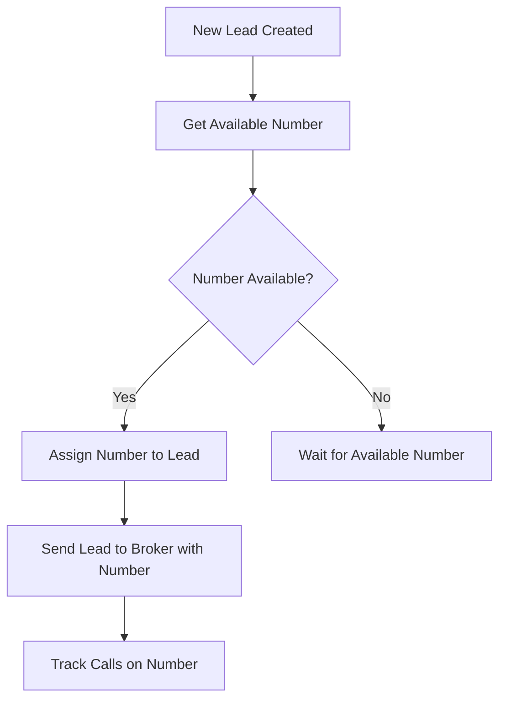
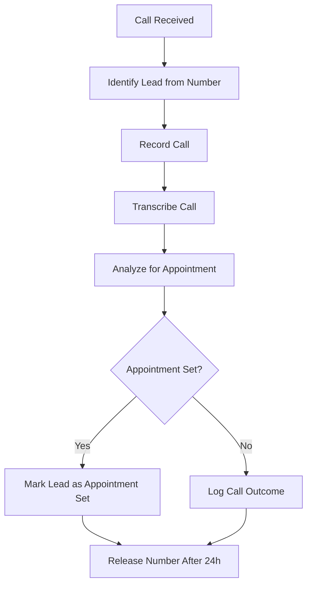

# SignalWire Integration Guide

## 🎯 Overview
This guide explains how to set up SignalWire for call pool management in the Equity Connect system, replacing CallRail for more cost-effective call tracking.

---

## 🚀 SignalWire Setup

### 1. Create SignalWire Account

1. Go to [signalwire.com](https://signalwire.com)
2. Sign up for a free account
3. Verify your phone number
4. Complete account setup

### 2. Get API Credentials

1. Go to **API** section in SignalWire dashboard
2. Create a new API token with these permissions:
   - **Phone Numbers**: Read, Write
   - **Calls**: Read, Write
   - **Messages**: Read, Write
3. Copy the following:
   - **Project ID**: Your project identifier
   - **API Token**: Your API authentication token
   - **Space URL**: `https://your-space.signalwire.com`

### 3. Purchase Phone Numbers

1. Go to **Phone Numbers** in SignalWire dashboard
2. Purchase 10-15 local phone numbers for your call pool
3. Choose numbers from your target markets
4. Enable call recording and transcription

---

## 📊 Call Pool Management

### Database Schema

The `call_pool` table manages SignalWire phone numbers:

```sql
CREATE TABLE call_pool (
  id UUID PRIMARY KEY DEFAULT gen_random_uuid(),
  phone_number TEXT NOT NULL,
  signalwire_id TEXT NOT NULL,
  status TEXT DEFAULT 'available' CHECK (status IN ('available', 'assigned', 'busy', 'maintenance')),
  assigned_lead_id UUID REFERENCES leads(id),
  assigned_broker_id UUID REFERENCES brokers(id),
  assigned_at TIMESTAMP WITH TIME ZONE,
  released_at TIMESTAMP WITH TIME ZONE,
  call_count INTEGER DEFAULT 0,
  last_call_at TIMESTAMP WITH TIME ZONE,
  created_at TIMESTAMP WITH TIME ZONE DEFAULT NOW()
);
```

### Call Pool Workflow

1. **Lead Assignment**: When a lead is created, assign an available phone number
2. **Call Tracking**: Track all calls to the assigned number
3. **Appointment Verification**: Use call data to verify appointments
4. **Number Release**: Release the number after appointment or 24 hours

---

## 🔧 n8n Integration

### 1. Add SignalWire Credentials

1. Go to n8n **Credentials**
2. Add new credential: **SignalWire API**
3. Enter:
   - **Project ID**: Your SignalWire project ID
   - **API Token**: Your SignalWire API token
   - **Space URL**: Your SignalWire space URL

### 2. Call Pool Management Nodes

#### Get Available Number
```json
{
  "url": "https://your-project.supabase.co/rest/v1/call_pool",
  "method": "GET",
  "query": {
    "status": "eq.available",
    "limit": "1"
  }
}
```

#### Assign Number to Lead
```json
{
  "url": "https://your-project.supabase.co/rest/v1/call_pool",
  "method": "PATCH",
  "body": {
    "status": "assigned",
    "assigned_lead_id": "{{$json.lead_id}}",
    "assigned_broker_id": "{{$json.broker_id}}",
    "assigned_at": "{{new Date().toISOString()}}"
  }
}
```

#### Release Number
```json
{
  "url": "https://your-project.supabase.co/rest/v1/call_pool",
  "method": "PATCH",
  "body": {
    "status": "available",
    "assigned_lead_id": null,
    "assigned_broker_id": null,
    "released_at": "{{new Date().toISOString()}}"
  }
}
```

---

## 📞 Call Tracking Features

### 1. Call Recording
- **Automatic Recording**: All calls are recorded by default
- **Storage**: Recordings stored in SignalWire cloud
- **Access**: Download recordings via API

### 2. Call Transcription
- **Real-time**: Live transcription during calls
- **Post-call**: Full transcription after call ends
- **Accuracy**: High accuracy with SignalWire's AI

### 3. Call Analytics
- **Duration**: Track call length
- **Outcome**: Success/failure status
- **Sentiment**: Analyze call sentiment
- **Keywords**: Track important keywords

---

## 🔄 Workflow Integration

### 1. Lead Assignment Flow



### 2. Appointment Verification Flow



---

## 📊 Monitoring & Analytics

### 1. Call Pool Metrics

Track these key metrics:
- **Utilization Rate**: Percentage of numbers in use
- **Average Assignment Time**: How long numbers stay assigned
- **Call Volume**: Calls per number per day
- **Success Rate**: Percentage of calls that result in appointments

### 2. Lead Performance

Monitor lead performance by phone number:
- **Response Rate**: Percentage of leads that call
- **Appointment Rate**: Percentage of calls that result in appointments
- **Conversion Rate**: Percentage of appointments that convert

### 3. Broker Performance

Track broker performance by assigned numbers:
- **Call Handling**: How brokers handle assigned calls
- **Appointment Setting**: Success rate in setting appointments
- **Follow-up**: Follow-up call performance

---

## 🚨 Troubleshooting

### Common Issues

#### 1. No Available Numbers
- **Cause**: All numbers assigned, none released
- **Solution**: Implement automatic release after 24 hours
- **Prevention**: Monitor pool utilization and add more numbers

#### 2. Call Not Recording
- **Cause**: Recording not enabled on number
- **Solution**: Enable recording in SignalWire dashboard
- **Prevention**: Verify recording settings when adding numbers

#### 3. Transcription Issues
- **Cause**: Poor audio quality or language settings
- **Solution**: Check audio quality and transcription settings
- **Prevention**: Use high-quality phone numbers and clear audio

### Debug Queries

```sql
-- Check call pool status
SELECT status, COUNT(*) as count 
FROM call_pool 
GROUP BY status;

-- Find numbers assigned too long
SELECT phone_number, assigned_at, 
       NOW() - assigned_at as duration
FROM call_pool 
WHERE status = 'assigned' 
  AND assigned_at < NOW() - INTERVAL '24 hours';

-- Check call volume per number
SELECT phone_number, call_count, last_call_at
FROM call_pool 
ORDER BY call_count DESC;
```

---

## 💰 Cost Optimization

### SignalWire Pricing
- **Phone Numbers**: $1-3/month per number
- **Call Recording**: $0.01/minute
- **Transcription**: $0.02/minute
- **API Calls**: $0.001 per call

### Cost Optimization Tips
1. **Right-size Pool**: Only maintain numbers you need
2. **Efficient Assignment**: Release numbers quickly after appointments
3. **Quality Numbers**: Use high-quality numbers for better results
4. **Monitor Usage**: Track costs and optimize usage

---

## 🔒 Security & Compliance

### 1. Call Recording Compliance
- **TCPA Compliance**: Ensure proper consent for recording
- **State Laws**: Check state-specific recording laws
- **Disclosure**: Always inform callers about recording

### 2. Data Protection
- **Encryption**: All recordings encrypted in transit and at rest
- **Access Control**: Limit access to call recordings
- **Retention**: Set appropriate retention periods

### 3. Privacy
- **PII Protection**: Protect personally identifiable information
- **Data Minimization**: Only collect necessary data
- **Right to Deletion**: Implement data deletion procedures

---

## 📈 Scaling

### 1. Pool Scaling
- **Add Numbers**: Increase pool size as you scale
- **Geographic Distribution**: Add numbers from different areas
- **Load Balancing**: Distribute calls across numbers

### 2. Performance Scaling
- **Call Routing**: Implement intelligent call routing
- **Queue Management**: Handle high call volumes
- **Quality Monitoring**: Monitor call quality and performance

### 3. Feature Scaling
- **Advanced Analytics**: Add more detailed analytics
- **AI Integration**: Use AI for call analysis
- **Automation**: Automate more call handling processes

---

## 🎯 Best Practices

### 1. Number Management
- **Regular Rotation**: Rotate numbers to avoid spam
- **Quality Monitoring**: Monitor number reputation
- **Backup Numbers**: Keep backup numbers for emergencies

### 2. Call Handling
- **Quick Response**: Respond to calls quickly
- **Professional Greeting**: Use professional voicemail greetings
- **Follow-up**: Follow up on missed calls

### 3. Data Management
- **Regular Cleanup**: Clean up old call data
- **Backup**: Regular backup of call recordings
- **Archival**: Archive old data to reduce costs

---

## 🚀 Next Steps

1. **Set up SignalWire account** and get API credentials
2. **Purchase phone numbers** for your call pool
3. **Configure n8n workflow** with SignalWire integration
4. **Test call assignment** and tracking
5. **Monitor performance** and optimize as needed

---

**Ready to implement?** Follow this guide step-by-step and you'll have a fully functional call pool management system in under 1 hour! 🚀
