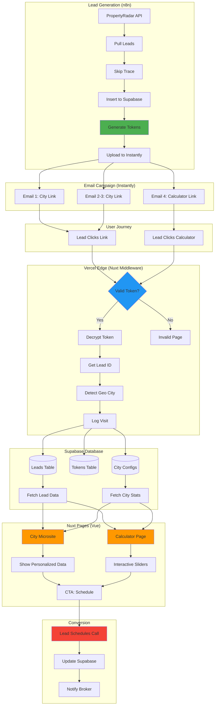
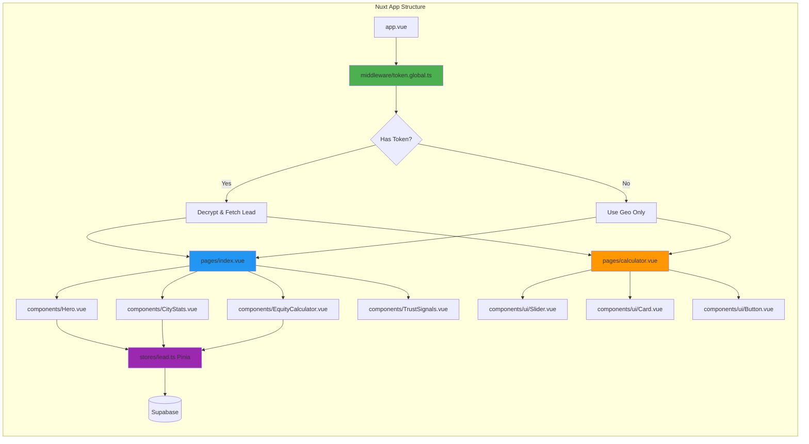
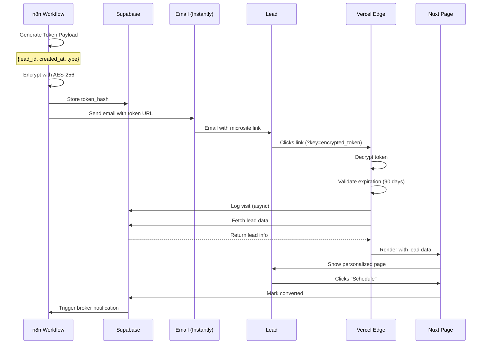

# Equity Connect - Vue 3 + Nuxt 3 Microsite Architecture

**Framework:** Vue 3 + Nuxt 3 + shadcn-vue + Tailwind CSS  
**Status:** Planned - Ready to Implement  
**Priority:** Phase 2 (After core lead generation is stable)  
**Updated:** October 19, 2025

---

## 📊 Architecture Diagram



### **Flow Explained:**

1. **Lead Gen** → n8n pulls leads, generates encrypted tokens
2. **Email** → Instantly sends emails with microsite links
3. **Click** → Lead clicks link with token
4. **Edge** → Vercel middleware decrypts token, detects city
5. **Page** → Nuxt renders personalized Vue page
6. **Convert** → Lead schedules appointment

---

## 🏗️ Component Architecture



---

## 🔐 Token Flow Diagram



---

## 🎯 Stack Decision

**Switched from Next.js to Vue 3 + Nuxt 3 for:**
- ✅ Faster development (simpler syntax)
- ✅ Better DX (developer experience)
- ✅ Lighter bundle size
- ✅ Beautiful UI with shadcn-vue
- ✅ All the SSR/SEO benefits of Nuxt
- ✅ Still deploys to Vercel easily

---

## 📦 Tech Stack

```
Framework: Nuxt 3 (Vue 3)
Components: shadcn-vue
Styling: Tailwind CSS
Database: Supabase
State Management: Pinia
Deployment: Vercel
Real-time: Supabase Realtime
```

---

## 🚀 Quick Start

### **Create Project:**

```bash
# Create Nuxt 3 app
npx nuxi@latest init equity-connect-microsite
cd equity-connect-microsite

# Install dependencies
npm install

# Add Tailwind
npm install -D @nuxtjs/tailwindcss

# Add shadcn-vue
npx shadcn-vue@latest init

# Add Supabase
npm install @supabase/supabase-js

# Add other dependencies
npm install crypto-js pinia
```

---

## 📁 Project Structure

```
equity-connect-microsite/
├── nuxt.config.ts              # Nuxt configuration
├── app.vue                     # Root component
├── middleware/
│   └── token.global.ts         # Token + geo detection (CRITICAL)
├── pages/
│   ├── index.vue              # City microsite (main page)
│   ├── calculator.vue         # Interactive calculator
│   ├── expired.vue            # Token expired page
│   └── invalid.vue            # Invalid token page
├── components/
│   ├── ui/                    # shadcn-vue components
│   │   ├── button.vue
│   │   ├── card.vue
│   │   ├── input.vue
│   │   └── slider.vue
│   ├── Hero.vue
│   ├── CityStats.vue
│   ├── EquityCalculator.vue
│   ├── TrustSignals.vue
│   └── Footer.vue
├── composables/
│   ├── useCrypto.ts           # Token encryption/decryption
│   ├── useSupabase.ts         # Database client
│   ├── useFormatting.ts       # Money/number helpers
│   └── useGeo.ts              # Geo detection helpers
├── stores/
│   └── lead.ts                # Pinia store for lead data
└── public/
    └── images/
```

---

## 🔐 Critical Files

### **`middleware/token.global.ts`** (Nuxt Middleware)

```typescript
export default defineNuxtRouteMiddleware(async (to) => {
  const token = to.query.key as string;
  const { decrypt, hashToken } = useCrypto();
  const leadStore = useLeadStore();
  
  // Nuxt provides geo data from Vercel automatically
  const geoCity = useRequestHeaders()['x-vercel-ip-city'] || 'your area';
  const geoState = useRequestHeaders()['x-vercel-ip-country-region'] || '';
  
  console.log('Geo detected:', geoCity, geoState);
  
  if (token) {
    try {
      // Decrypt token to get lead_id
      const decrypted = decrypt(token);
      const { lead_id, created_at, type } = JSON.parse(decrypted);
      
      // Check expiration (90 days)
      const age = Date.now() - created_at;
      const ninetyDays = 90 * 24 * 60 * 60 * 1000;
      
      if (age > ninetyDays) {
        return navigateTo('/expired');
      }
      
      // Log visit (async)
      logVisit(hashToken(token), geoCity, geoState);
      
      // Store lead data
      leadStore.setLeadId(lead_id);
      leadStore.setGeoCity(geoCity);
      leadStore.setGeoState(geoState);
      leadStore.setHasLeadData(true);
      
    } catch (error) {
      console.error('Token decrypt failed:', error);
      return navigateTo('/invalid');
    }
  } else {
    // No token? Store geo data only
    leadStore.setGeoCity(geoCity);
    leadStore.setGeoState(geoState);
    leadStore.setHasLeadData(false);
  }
});

async function logVisit(tokenHash: string, city: string, state: string) {
  const { $supabase } = useNuxtApp();
  
  try {
    await $supabase.rpc('log_microsite_visit', {
      p_token_hash: tokenHash,
      p_detected_city: city,
      p_detected_state: state
    });
  } catch (e) {
    console.error('Failed to log visit:', e);
  }
}
```

---

### **`composables/useCrypto.ts`** (Token Encryption)

```typescript
import CryptoJS from 'crypto-js';

export const useCrypto = () => {
  const config = useRuntimeConfig();
  const SECRET_KEY = config.public.micrositeSecretKey;

  const encrypt = (data: string): string => {
    const encrypted = CryptoJS.AES.encrypt(data, SECRET_KEY);
    return encrypted.toString();
  };

  const decrypt = (encrypted: string): string => {
    const decrypted = CryptoJS.AES.decrypt(encrypted, SECRET_KEY);
    return decrypted.toString(CryptoJS.enc.Utf8);
  };

  const hashToken = (token: string): string => {
    return CryptoJS.SHA256(token).toString();
  };

  const generateToken = (leadId: string, type: 'city_page' | 'calculator'): string => {
    const payload = {
      lead_id: leadId,
      created_at: Date.now(),
      type: type
    };
    
    const encrypted = encrypt(JSON.stringify(payload));
    return encodeURIComponent(encrypted);
  };

  return {
    encrypt,
    decrypt,
    hashToken,
    generateToken
  };
};
```

---

### **`stores/lead.ts`** (Pinia Store)

```typescript
import { defineStore } from 'pinia';

export const useLeadStore = defineStore('lead', {
  state: () => ({
    leadId: null as string | null,
    leadData: null as any,
    geoCity: 'your area',
    geoState: '',
    hasLeadData: false,
  }),

  actions: {
    setLeadId(id: string) {
      this.leadId = id;
    },

    setGeoCity(city: string) {
      this.geoCity = city;
    },

    setGeoState(state: string) {
      this.geoState = state;
    },

    setHasLeadData(has: boolean) {
      this.hasLeadData = has;
    },

    async fetchLeadData() {
      if (!this.leadId) return;

      const { $supabase } = useNuxtApp();
      
      const { data, error } = await $supabase
        .from('leads')
        .select('*')
        .eq('id', this.leadId)
        .single();

      if (error) {
        console.error('Failed to fetch lead:', error);
        return;
      }

      this.leadData = data;
    }
  },

  getters: {
    displayCity(): string {
      return this.leadData?.property_city || this.geoCity;
    },

    formattedEquity(): string {
      if (!this.leadData?.estimated_equity) return '$0';
      return new Intl.NumberFormat('en-US', {
        style: 'currency',
        currency: 'USD',
        maximumFractionDigits: 0
      }).format(this.leadData.estimated_equity);
    }
  }
});
```

---

### **`pages/index.vue`** (City Microsite)

```vue
<script setup lang="ts">
import { Button } from '@/components/ui/button';
import { Card, CardHeader, CardTitle, CardContent } from '@/components/ui/card';

const leadStore = useLeadStore();
const { displayCity, formattedEquity } = storeToRefs(leadStore);

// Fetch lead data if token was valid
onMounted(async () => {
  if (leadStore.hasLeadData) {
    await leadStore.fetchLeadData();
  }
});

// Fetch city config
const { data: cityConfig } = await useAsyncData('cityConfig', async () => {
  const { $supabase } = useNuxtApp();
  const { data } = await $supabase
    .from('city_microsite_configs')
    .select('*')
    .eq('city_name', displayCity.value)
    .single();
  return data;
});
</script>

<template>
  <div class="min-h-screen bg-gradient-to-b from-slate-50 to-white">
    <!-- Hero Section -->
    <Hero 
      :city="displayCity" 
      :lead-name="leadStore.leadData?.first_name"
    />

    <!-- City Stats -->
    <CityStats 
      v-if="cityConfig"
      :city-name="displayCity"
      :avg-home-value="cityConfig.avg_home_value"
      :avg-equity="cityConfig.avg_equity"
      :total-homeowners="cityConfig.total_homeowners_62_plus"
    />

    <!-- Personalized Calculator (if lead data) -->
    <section v-if="leadStore.hasLeadData && leadStore.leadData" class="py-16 px-4">
      <div class="max-w-4xl mx-auto">
        <Card>
          <CardHeader>
            <CardTitle>Your Estimated Equity</CardTitle>
          </CardHeader>
          <CardContent>
            <EquityCalculator 
              :property-value="leadStore.leadData.property_value"
              :estimated-equity="leadStore.leadData.estimated_equity"
            />
            
            <div class="mt-8 text-center">
              <Button size="lg" @click="navigateTo('/schedule')">
                Schedule Free Consultation
              </Button>
            </div>
          </CardContent>
        </Card>
      </div>
    </section>

    <!-- Trust Signals -->
    <TrustSignals :city="displayCity" />

    <!-- Footer -->
    <Footer />
  </div>
</template>
```

---

### **`pages/calculator.vue`** (Interactive Calculator)

```vue
<script setup lang="ts">
import { ref, computed } from 'vue';
import { Button } from '@/components/ui/button';
import { Slider } from '@/components/ui/slider';
import { Card, CardHeader, CardTitle, CardContent } from '@/components/ui/card';

const leadStore = useLeadStore();

const homeValue = ref(leadStore.leadData?.property_value || 500000);
const mortgageBalance = ref(0);
const accessPercent = ref([55]);

const equity = computed(() => homeValue.value - mortgageBalance.value);
const accessAmount = computed(() => equity.value * (accessPercent.value[0] / 100));

const formatMoney = (value: number) => {
  return new Intl.NumberFormat('en-US', {
    style: 'currency',
    currency: 'USD',
    maximumFractionDigits: 0
  }).format(value);
};

onMounted(async () => {
  if (leadStore.hasLeadData) {
    await leadStore.fetchLeadData();
  }
});
</script>

<template>
  <div class="min-h-screen bg-gradient-to-b from-blue-50 to-white py-16 px-4">
    <div class="max-w-3xl mx-auto">
      <h1 class="text-4xl font-bold text-center mb-4">
        See What You Could Access
      </h1>

      <div v-if="leadStore.hasLeadData && leadStore.leadData" class="text-center mb-8">
        <p class="text-lg text-gray-700">
          Hi {{ leadStore.leadData.first_name }},
        </p>
        <p class="text-gray-600">
          Based on your {{ leadStore.displayCity }} property, here's what you could potentially access:
        </p>
      </div>

      <Card class="mb-8">
        <CardHeader>
          <CardTitle>Adjust Your Numbers</CardTitle>
        </CardHeader>
        <CardContent class="space-y-6">
          <!-- Home Value Slider -->
          <div>
            <label class="block text-sm font-medium mb-2">
              Home Value: {{ formatMoney(homeValue) }}
            </label>
            <Slider 
              v-model="homeValue"
              :min="200000"
              :max="3000000"
              :step="10000"
            />
          </div>

          <!-- Mortgage Balance Slider -->
          <div>
            <label class="block text-sm font-medium mb-2">
              Mortgage Balance: {{ formatMoney(mortgageBalance) }}
            </label>
            <Slider 
              v-model="mortgageBalance"
              :min="0"
              :max="homeValue"
              :step="5000"
            />
          </div>

          <!-- Access Percentage Slider -->
          <div>
            <label class="block text-sm font-medium mb-2">
              Access Percentage: {{ accessPercent[0] }}%
            </label>
            <Slider 
              v-model="accessPercent"
              :min="50"
              :max="60"
              :step="1"
            />
          </div>
        </CardContent>
      </Card>

      <!-- Results -->
      <div class="grid md:grid-cols-2 gap-6 mb-8">
        <Card>
          <CardContent class="pt-6">
            <h2 class="text-xl font-semibold mb-2">Your Estimated Equity</h2>
            <p class="text-4xl font-bold text-blue-600">
              {{ formatMoney(equity) }}
            </p>
          </CardContent>
        </Card>

        <Card class="bg-gradient-to-br from-blue-500 to-blue-600 text-white">
          <CardContent class="pt-6">
            <h2 class="text-xl font-semibold mb-2">You Could Access</h2>
            <p class="text-4xl font-bold">
              {{ formatMoney(accessAmount) }}
            </p>
            <p class="text-sm mt-2 opacity-90">
              *Estimated. Actual amount depends on age, property, and other factors.
            </p>
          </CardContent>
        </Card>
      </div>

      <!-- CTA -->
      <div class="text-center">
        <h3 class="text-2xl font-bold mb-4">
          Ready to Learn Your Exact Numbers?
        </h3>
        <Button size="lg" @click="navigateTo('/schedule')">
          Schedule Free Consultation
        </Button>
        <p class="text-gray-600 mt-4">
          No obligation. Licensed specialists. 15+ years experience.
        </p>
      </div>
    </div>
  </div>
</template>
```

---

## 🔧 `nuxt.config.ts`

```typescript
export default defineNuxtConfig({
  devtools: { enabled: true },

  modules: [
    '@nuxtjs/tailwindcss',
    '@pinia/nuxt',
  ],

  css: ['~/assets/css/main.css'],

  runtimeConfig: {
    public: {
      supabaseUrl: process.env.NUXT_PUBLIC_SUPABASE_URL,
      supabaseKey: process.env.NUXT_PUBLIC_SUPABASE_ANON_KEY,
      micrositeSecretKey: process.env.MICROSITE_SECRET_KEY,
    },
    supabaseServiceKey: process.env.SUPABASE_SERVICE_ROLE_KEY,
  },

  app: {
    head: {
      title: 'Equity Connect - Access Your Home Equity',
      meta: [
        { charset: 'utf-8' },
        { name: 'viewport', content: 'width=device-width, initial-scale=1' },
        { 
          name: 'description', 
          content: 'Unlock tax-free cash from your home equity. Licensed reverse mortgage specialists.' 
        },
      ],
    },
  },

  nitro: {
    preset: 'vercel',
  },
});
```

---

## 🌐 Vercel Deployment

### **1. Install Vercel CLI:**

```bash
npm install -g vercel
```

### **2. Deploy:**

```bash
# Build and deploy
vercel deploy --prod
```

### **3. Add Domains:**

Same 15 domains as Next.js version - Vercel works identically with Nuxt!

### **4. Environment Variables:**

```bash
NUXT_PUBLIC_SUPABASE_URL=https://mxnqfwuhvurajrgoefyg.supabase.co
NUXT_PUBLIC_SUPABASE_ANON_KEY=your-anon-key
SUPABASE_SERVICE_ROLE_KEY=your-service-key
MICROSITE_SECRET_KEY=your-256-bit-key
```

---

## ✅ Benefits of Vue 3 + Nuxt 3

**vs Next.js:**
- ✅ **Simpler syntax** - Less boilerplate
- ✅ **Faster to build** - Cleaner component structure
- ✅ **Lighter bundle** - Better performance
- ✅ **shadcn-vue** - Beautiful components
- ✅ **Same SEO/SSR** - Nuxt handles it all

**Same Features:**
- ✅ Server-side rendering
- ✅ Automatic routing
- ✅ Edge runtime on Vercel
- ✅ Geo detection
- ✅ API routes
- ✅ TypeScript support

---

## 📊 Implementation Timeline

**Day 1:**
- [ ] Create Nuxt project
- [ ] Install shadcn-vue + Tailwind
- [ ] Set up Supabase plugin
- [ ] Build token middleware
- [ ] Create Pinia stores

**Day 2:**
- [ ] Build city microsite page
- [ ] Build calculator page
- [ ] Add shadcn-vue components
- [ ] Style with Tailwind
- [ ] Test token flow

**Day 3:**
- [ ] Deploy to Vercel
- [ ] Configure 15 domains
- [ ] Test on multiple domains
- [ ] Integrate with n8n
- [ ] Monitor analytics

**Total: 3 days** (vs 2 days with Next.js, but easier to maintain!)

---

## 💰 Cost

**Same as Next.js:**
- Vercel Pro: $20/month
- Domain renewals: ~$150/year
- **Total: $20/month**

---

## 🎨 shadcn-vue Components

Pre-built components to use:
- `Button` - CTA buttons
- `Card` - Content containers
- `Slider` - Calculator inputs
- `Input` - Form fields
- `Dialog` - Modals
- `Badge` - Trust signals
- `Avatar` - Broker photos

All fully customizable with Tailwind!

---

**Status:** Ready to implement  
**Framework:** Vue 3 + Nuxt 3 + shadcn-vue  
**Deployment:** Vercel (same as Next.js)  
**Timeline:** 3 days  
**Priority:** Phase 2

